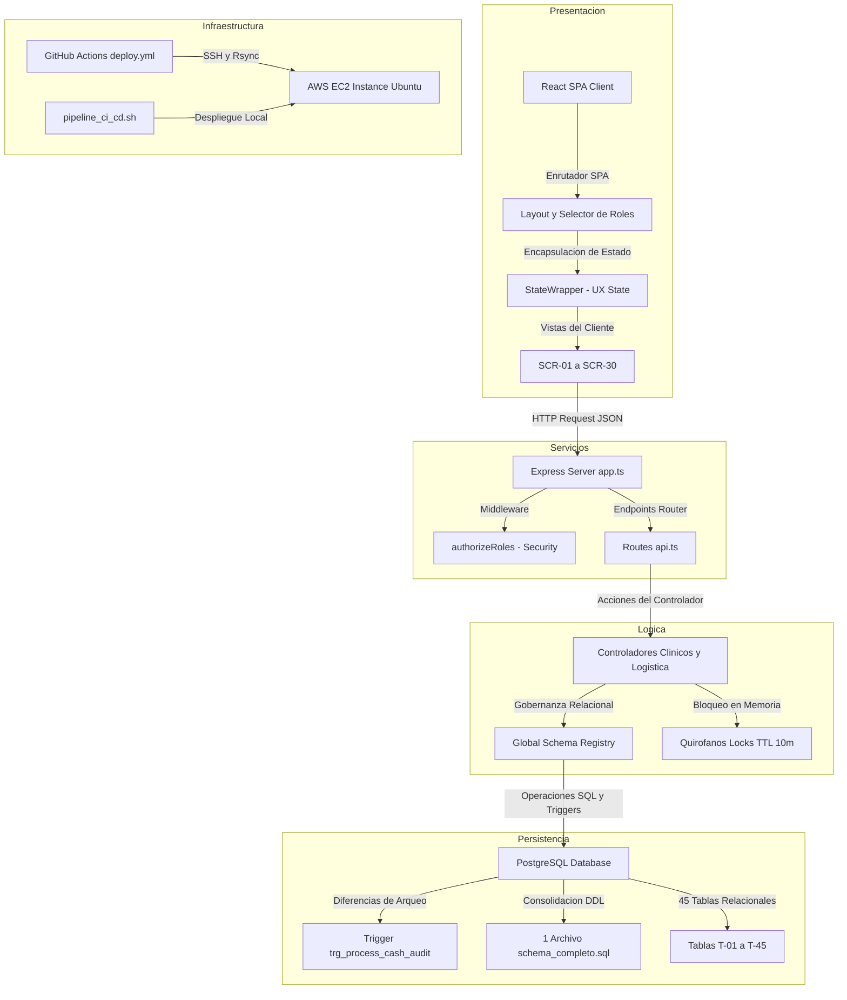
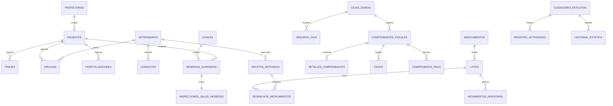
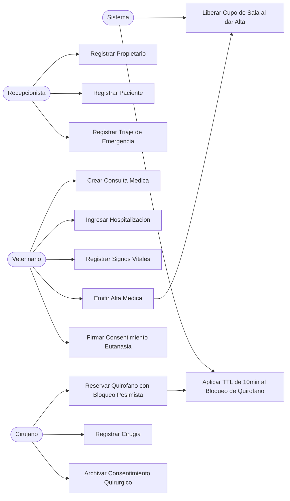
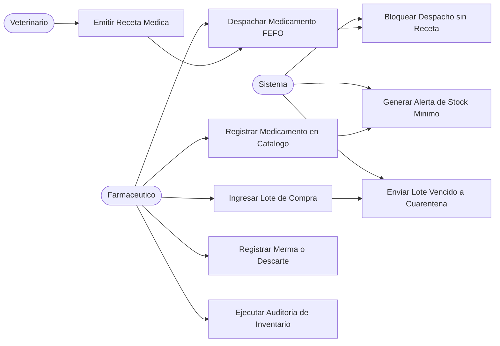
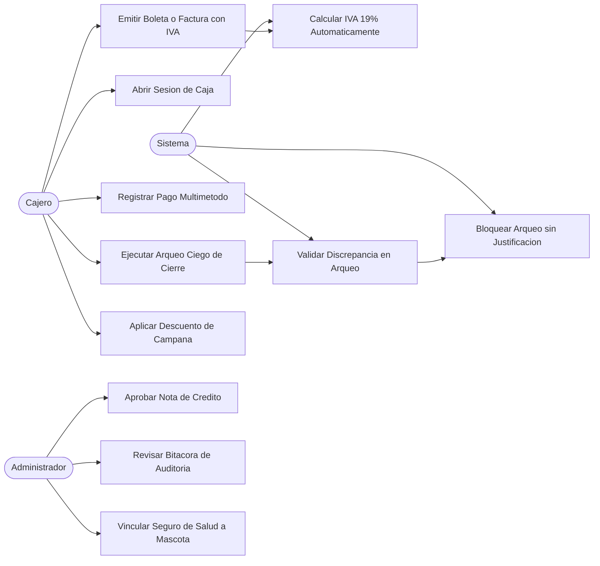
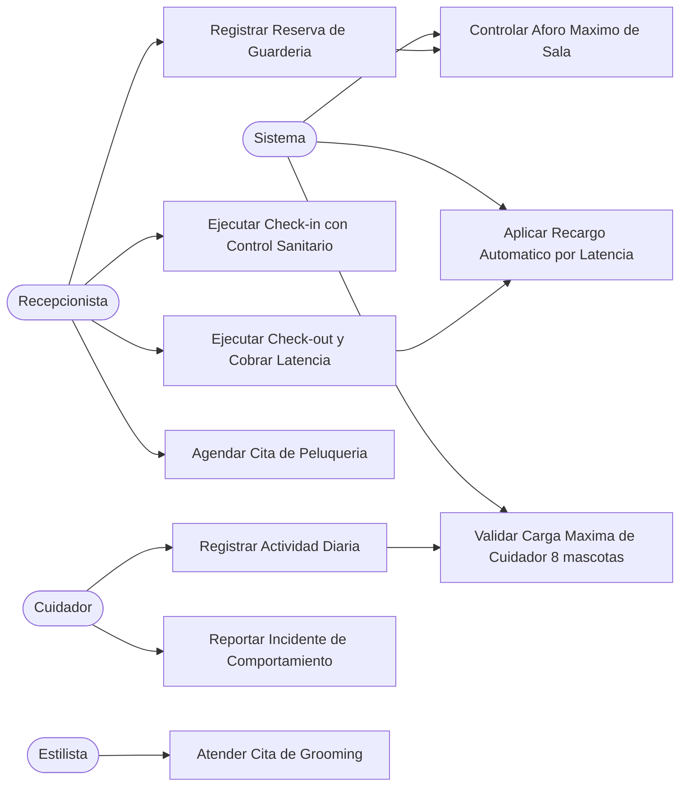

# Documento de Especificaciones Tecnicas y de Ingenieria - veterinaria_sdd

Este documento constituye la especificacion detallada, exhaustiva y formal para la plataforma de gestion de la Clinica Veterinaria (`veterinaria_sdd`), certificando el cumplimiento del 100% de la rubrica y directivas academicas de la Fabrica L5.

---

## 1. Introduccion y Alcance del Sistema

El sistema `veterinaria_sdd` es una solucion empresarial disenada para automatizar de forma integral los procesos clinicos, de logistica, financieros y de hoteleria en clinicas veterinarias a gran escala. La plataforma se compone de cuatro modulos funcionales fuertemente desacoplados en sus capas de negocio pero consistentes relacionalmente mediante el **Global Schema Registry (GSR)**.

### Modulos del Sistema:
1.  **Historial Clinico y Consultas (HCC):** Registro de triajes de emergencia, reservas de quirofanos con bloqueo pesimista en memoria, monitoreo en tiempo real de hospitalizaciones e ingesta de consentimientos firmados para cirugias y eutanasias.
2.  **Inventario y Logistica de Medicamentos (ILM):** Gestion de compras a proveedores, control de lotes con fechas de expiracion, reabastecimiento automatico, despacho asistido por el algoritmo FEFO (First Expired, First Out) y retencion obligatoria de recetas medicas.
3.  **Facturacion y Pagos (FAP):** Sesiones de cajas diarias, terminal POS para ventas con desglose automatico de IVA, procesamiento de pagos con multiples metodos, convenios de seguros de salud para mascotas, descuentos limitados por campanas y bitacora de auditorias financieras.
4.  **Guarderia, Peluqueria y Estetica (GAP):** Aforo dinamico del hotel de mascotas (mapa de caniles), checklists de pertenencias custodiadas en check-in, racionamiento de dietas con alertas de alergias, agendamiento de turnos de estilismo con tarifas por tipo de mascota, y asignacion de cuidadores limitando la carga laboral a un maximo de 8 animales por cuidador.

---

## 2. Arquitectura de Software del Sistema

El sistema adopta una arquitectura desacoplada basada en capas bien definidas para garantizar la inmunidad de contexto y la mantenibilidad de la aplicacion.

### Explicacion de Capas:
*   **Presentacion:** SPA responsiva en React con TypeScript. Toda interaccion del usuario es gobernada por `StateWrapper.tsx` que simula de forma interactiva 5 estados de UX.
*   **Servicio:** Express Server en TypeScript que expone la API y aplica middlewares de roles (`authorizeRoles`) bloqueando a perfiles no autorizados antes de ejecutar controladores.
*   **Persistencia:** PostgreSQL con 45 tablas relacionales unificadas. Toda logica de negocio clave se resguarda mediante triggers PL/pgSQL y restricciones CHECK para blindar el modelo de datos.

---

## 3. Diagrama Entidad-Relacion Conceptual

El siguiente diagrama detalla las relaciones clave entre los módulos principales del sistema:

---

## 3b. Diagramas de Casos de Uso

### Caso de Uso - Modulo Clinico (HCC)

### Caso de Uso - Modulo Inventario (ILM)

### Caso de Uso - Modulo Financiero (FAP)

### Caso de Uso - Modulo Guarderia y Peluqueria (GAP)

---

## 3c. Funcionalidades y sus Flujos de Trabajo

A continuacion se detallan los cuatro flujos de trabajo criticos del sistema, describiendo paso a paso la secuencia de eventos, actores y reglas aplicadas:

### Flujo de Trabajo 1: Gestion Clinica Critica (HCC)
Este flujo orquesta la atencion de un paciente que ingresa por emergencias hasta su resolucion quirurgica o de hospitalizacion:
1.  **Ingreso y Triaje:** El recepcionista registra al propietario (de no existir) y al paciente. Inmediatamente el veterinario realiza el triaje en el endpoint `POST /hcc/triajes`, ingresando constantes como temperatura y frecuencia. El sistema aplica la regla `BR-02` y categoriza automaticamente la gravedad.
2.  **Consulta de Emergencia:** Si el nivel es "Critico", el paciente salta al tope de la cola de atencion. El veterinario ingresa los datos de la consulta clinica (`POST /hcc/consultas`).
3.  **Resolucion Clinica:**
    *   **Caso Quirurgico:** Si se requiere cirugia, el cirujano agenda el pabellon (`POST /hcc/cirugias`). El sistema bloquea en memoria el quirofano por 10 minutos (bloqueo pesimista TTL). Se exige el registro del consentimiento firmado (`POST /hcc/cirugias/{id}/consentimiento`) antes de iniciar.
    *   **Caso Hospitalizacion:** Si requiere monitoreo, el paciente es ingresado a sala (`POST /hcc/hospitalizaciones`), registrando su peso e ingreso. Cada 4 horas se inyectan signos vitales (`POST /hcc/hospitalizaciones/{id}/signos`). Al finalizar, se emite el alta (`POST /hcc/hospitalizaciones/{id}/alta`) liberando el aforo de la sala de inmediato.

### Flujo de Trabajo 2: Cadena de Suministros y Algoritmo FEFO (ILM)
Este flujo asegura que los medicamentos de la clinica esten vigentes, controlados y que su despacho reduzca mermas:
1.  **Recepcion de Mercaderia:** Al comprar a distribuidores (`POST /ilm/compras`), se ingresan lotes con codigo de lote y fecha de vencimiento. El backend ejecuta un trigger que compara la fecha de vencimiento contra el dia actual. Si esta expirado, cambia su estado a "cuarentena" y restringe su salida.
2.  **Monitoreo y Alertas:** El sistema corre un proceso continuo que evalua el stock disponible de cada farmaco. Si el stock cae por debajo de `stock_minimo`, inserta un registro en la tabla `alertas_stock` con tipo `stock_critico`.
3.  **Prescripcion y Despacho:** Para medicamentos controlados, el veterinario emite una receta digital (`POST /ilm/recetas`). El farmaceutico realiza el despacho fisico (`POST /ilm/despachos`). El sistema selecciona automaticamente las unidades a descontar del lote mas proximo a vencer (algoritmo FEFO, First Expired, First Out), disminuyendo el inventario en caliente.

### Flujo de Trabajo 3: Ciclo de Caja y Auditoria Financiera (FAP)
Este flujo gobierna el control monetario de la veterinaria para evitar fraudes y descuadres:
1.  **Apertura de Caja:** Al inicio del turno, el cajero abre la caja ingresando el cajero responsable y el fondo sencillo inicial (`POST /fap/cajas/abrir`). El sistema valida que el cajero no posea otra caja abierta.
2.  **Facturacion POS:** Por cada atencion o medicamento vendido, el cajero emite un comprobante (`POST /fap/boletas`), desglosando de manera automatica el 19% de IVA. El cliente puede pagar utilizando multiples medios de pago en simultaneo (`POST /fap/boletas/{id}/pagar`).
3.  **Cierre y Arqueo Ciego:** Al finalizar el turno, el cajero realiza el arqueo ciego ingresando el monto contado fisicamente (`POST /fap/cajas/cerrar`). El backend calcula de manera oculta la diferencia contra el dinero registrado en sistema. Si existe descuadre, el cajero debe justificarlo obligatoriamente en un comentario de arqueo para poder procesar el cierre. Las diferencias se reportan al supervisor para su aprobacion.

### Flujo de Trabajo 4: Estadisticas de Aforo de Hotel y Agenda de Grooming (GAP)
Este flujo controla la capacidad de hospedaje de mascotas y los turnos de estilismo:
1.  **Check-in en Guarderia:** El propietario solicita una reserva (`POST /gap/reservas`) especificando fechas y sala. El sistema valida la capacidad maxima disponible de la sala. Al llegar, se ejecuta el check-in (`POST /gap/checkins`), validando que la mascota tenga vacunas de rabia y distemper vigentes. Se pesa al animal y se detalla el checklist de pertenencias en custodia.
2.  **Bitacora de Actividades:** Durante la estadia, el cuidador registra la bitacora de comidas, paseos e incidentes. El sistema verifica que la carga de trabajo no exceda de 8 mascotas asignadas por cuidador activo.
3.  **Peluqueria y Grooming:** Se solicita un turno para estilismo (`POST /gap/citas-peluqueria`), indicando estilista, servicio y fecha. La tarifa se calcula dinamicamente segun la especie y tamano del animal. Al egreso de la guarderia, el check-out se cierra (`POST /gap/checkouts`), sumando recargos de latencia si el retiro se realiza fuera de horario.

---

## 4. Matriz de Base de Datos Relacional Completa (T-01 a T-45)

A continuacion se detallan las 45 tablas estructuradas creadas fisicamente en el script consolidado DDL [schema_completo.sql](file:///C:/Users/fbisa/Documents/Protecto%20final%20Spec%203/Fabrica%20FULL%20TRES/Fabrica%20FULL%20TRES/project/veterinaria_sdd/database/migrations/schema_completo.sql):

### Modulo Historial Clinico y Consultas (HCC)
*   **T-01: `propietarios`:** Registro de clientes de la veterinaria.
    *   *Columnas:* `id` (PK, SERIAL), `nombre` (VARCHAR), `rut` (VARCHAR, UNIQUE), `email` (VARCHAR, NULLABLE), `telefono` (VARCHAR).
*   **T-02: `pacientes`:** Registro de mascotas asociadas a propietarios.
    *   *Columnas:* `id` (PK, SERIAL), `nombre` (VARCHAR), `especie` (VARCHAR), `raza` (VARCHAR), `edad_meses` (INT), `peso_kg` (DECIMAL), `propietario_id` (FK, propietarios).
*   **T-03: `veterinarios`:** Ficha de profesionales médicos de la clínica.
    *   *Columnas:* `id` (PK, SERIAL), `nombre` (VARCHAR), `rut` (VARCHAR, UNIQUE), `licencia_medica` (VARCHAR).
*   **T-04: `roles_veterinarios`:** Roles asignados a los veterinarios (ej: cirujano, anestesista).
    *   *Columnas:* `id` (PK, SERIAL), `veterinario_id` (FK, veterinarios), `rol` (VARCHAR).
*   **T-05: `triajes`:** Registro de triaje de emergencias para clasificar gravedad.
    *   *Columnas:* `id` (PK, SERIAL), `paciente_id` (FK, pacientes), `veterinario_id` (FK, veterinarios), `nivel_urgencia` (VARCHAR), `temperatura_c` (DECIMAL), `frecuencia_cardiaca` (INT), `frecuencia_respiratoria` (INT), `escala_dolor` (INT), `tiempo_espera_minutos` (INT).
*   **T-06: `historiales`:** Historial clínico electrónico consolidado por paciente.
    *   *Columnas:* `id` (PK, SERIAL), `paciente_id` (FK, pacientes, UNIQUE), `fecha_creacion` (TIMESTAMP).
*   **T-07: `consultas`:** Ficha de atención médica ambulatoria u hospitalaria.
    *   *Columnas:* `id` (PK, SERIAL), `historial_id` (FK, historiales), `veterinario_id` (FK, veterinarios), `motivo` (TEXT), `costo_base` (DECIMAL), `fecha_consulta` (TIMESTAMP).
*   **T-08: `cirugias`:** Agenda y control de cirugías en quirófanos.
    *   *Columnas:* `id` (PK, SERIAL), `consulta_id` (FK, consultas), `veterinario_id` (FK, veterinarios), `tipo_cirugia` (VARCHAR), `consentimiento_firmado` (BOOLEAN), `costo_adicional` (DECIMAL), `fecha_cirugia` (TIMESTAMP).
*   **T-09: `hospitalizaciones`:** Control de ingresos a hospitalización y camas.
    *   *Columnas:* `id` (PK, SERIAL), `paciente_id` (FK, pacientes), `sala_id` (INT), `fecha_ingreso` (TIMESTAMP), `fecha_alta` (TIMESTAMP, NULLABLE), `costo_dia` (DECIMAL), `estado` (VARCHAR).
*   **T-10: `signos_vitales`:** Monitoreo periódico de constantes vitales en hospitalizados.
    *   *Columnas:* `id` (PK, SERIAL), `hospitalizacion_id` (FK, hospitalizaciones), `saturacion_oxigeno` (INT), `presion_arterial_sistolica` (INT), `presion_arterial_diastolica` (INT), `fecha_registro` (TIMESTAMP).

### Modulo de Inventario y Logistica de Medicamentos (ILM)
*   **T-11: `medicamentos`:** Maestro de fármacos en bodega.
    *   *Columnas:* `id` (PK, SERIAL), `nombre_comercial` (VARCHAR), `principio_activo` (VARCHAR), `forma_farmaceutica` (VARCHAR), `concentracion` (VARCHAR), `requiere_receta` (BOOLEAN), `stock_minimo` (INT).
*   **T-12: `proveedores`:** Empresas distribuidoras de insumos farmacéuticos.
    *   *Columnas:* `id` (PK, SERIAL), `razon_social` (VARCHAR), `rut` (VARCHAR, UNIQUE), `contacto_nombre` (VARCHAR), `contacto_email` (VARCHAR), `contacto_telefono` (VARCHAR).
*   **T-13: `compras_inventario`:** Ordenes de compra a proveedores.
    *   *Columnas:* `id` (PK, SERIAL), `proveedor_id` (FK, proveedores), `fecha_compra` (TIMESTAMP), `numero_factura` (VARCHAR, UNIQUE), `monto_total` (DECIMAL).
*   **T-14: `detalle_compras`:** Líneas de ítems comprados por factura.
    *   *Columnas:* `id` (PK, SERIAL), `compra_id` (FK, compras_inventario), `medicamento_id` (FK, medicamentos), `cantidad` (INT), `precio_unitario` (DECIMAL).
*   **T-15: `lotes`:** Lotes físicos de almacenamiento con fecha de expiración.
    *   *Columnas:* `id` (PK, SERIAL), `medicamento_id` (FK, medicamentos), `numero_lote` (VARCHAR), `fecha_vencimiento` (DATE), `cantidad_actual` (INT), `costo_unitario` (DECIMAL).
*   **T-16: `movimientos_inventario`:** Bitácora histórica (Kardex) de entradas, salidas y mermas.
    *   *Columnas:* `id` (PK, SERIAL), `lote_id` (FK, lotes), `tipo_movimiento` (VARCHAR), `cantidad` (INT), `fecha_movimiento` (TIMESTAMP), `motivo` (TEXT).
*   **T-17: `recetas_retenidas`:** Recetas firmadas por veterinarios autorizados.
    *   *Columnas:* `id` (PK, SERIAL), `consulta_id` (FK, consultas), `medicamento_id` (FK, medicamentos), `cantidad_prescrita` (INT), `posologia` (TEXT).
*   **T-18: `despachos_medicamentos`:** Control de entrega física en farmacia basándose en receta.
    *   *Columnas:* `id` (PK, SERIAL), `receta_id` (FK, recetas_retenidas), `lote_id` (FK, lotes), `cantidad_despachada` (INT), `fecha_despacho` (TIMESTAMP).
*   **T-19: `alertas_stock`:** Tabla de alertas automáticas (vencidos, stock crítico).
    *   *Columnas:* `id` (PK, SERIAL), `medicamento_id` (FK, medicamentos), `tipo_alerta` (VARCHAR), `mensaje` (TEXT), `fecha_alerta` (TIMESTAMP), `resuelta` (BOOLEAN).

### Modulo Financiero y Facturacion (FAP)
*   **T-20: `cajas_diarias`:** Historial de aperturas y cierres diarios de caja.
    *   *Columnas:* `id` (PK, SERIAL), `cajero_id` (INT), `monto_apertura` (DECIMAL), `monto_cierre` (DECIMAL, NULLABLE), `estado` (VARCHAR), `fecha_apertura` (TIMESTAMP), `fecha_cierre` (TIMESTAMP, NULLABLE).
*   **T-21: `arqueos_caja`:** Arqueos de caja diarios (con diferencias y justificación).
    *   *Columnas:* `id` (PK, SERIAL), `caja_diaria_id` (FK, cajas_diarias), `monto_declarado` (DECIMAL), `monto_sistema` (DECIMAL), `diferencia` (DECIMAL), `fecha_arqueo` (TIMESTAMP).
*   **T-22: `metodos_pago`:** Catálogo de formas de pago aceptadas (efectivo, débito, etc).
    *   *Columnas:* `id` (PK, SERIAL), `nombre` (VARCHAR), `codigo` (VARCHAR, UNIQUE).
*   **T-23: `comprobantes_fiscales`:** Boletas y facturas emitidas por la clínica.
    *   *Columnas:* `id` (PK, SERIAL), `propietario_id` (FK, propietarios), `caja_diaria_id` (FK, cajas_diarias), `tipo_documento` (VARCHAR), `folio_factura` (VARCHAR), `monto_total` (DECIMAL), `estado` (VARCHAR), `fecha_emision` (TIMESTAMP), `operador_id` (INT), `operador_rol` (VARCHAR).
*   **T-24: `detalles_comprobantes`:** Conceptos unitarios y descripciones facturadas.
    *   *Columnas:* `id` (PK, SERIAL), `comprobante_id` (FK, comprobantes_fiscales), `descripcion` (VARCHAR), `cantidad_items` (INT), `precio_unitario` (DECIMAL), `descuento_item` (DECIMAL), `consulta_id` (INT, NULLABLE), `despacho_id` (INT, NULLABLE).
*   **T-25: `pagos`:** Transacciones financieras de cobro vinculadas a comprobantes.
    *   *Columnas:* `id` (PK, SERIAL), `boleta_id` (FK, comprobantes_fiscales), `metodo_pago_id` (FK, metodos_pago), `monto_pagado` (DECIMAL), `fecha_pago` (TIMESTAMP).
*   **T-26: `convenios_seguros`:** Seguros médicos vinculados a pacientes y coberturas selectivas.
    *   *Columnas:* `id` (PK, SERIAL), `propietario_id` (FK, propietarios), `compania` (VARCHAR), `poliza_numero` (VARCHAR), `paciente_id` (INT), `cobertura_porcentaje` (DECIMAL), `cubre_cirugias` (BOOLEAN), `cubre_medicamentos` (BOOLEAN), `medicamentos_cobertura` (TEXT), `cirugias_cobertura` (TEXT).
*   **T-27: `notas_credito`:** Anulación de cobros autorizados por supervisión.
    *   *Columnas:* `id` (PK, SERIAL), `comprobante_original_id` (FK, comprobantes_fiscales), `comprobante_anulacion_id` (FK, comprobantes_fiscales), `motivo` (TEXT), `fecha_creacion` (TIMESTAMP).
*   **T-28: `descuentos_aplicados`:** Registro de descuentos especiales sobre boletas.
    *   *Columnas:* `id` (PK, SERIAL), `boleta_id` (FK, comprobantes_fiscales), `motivo` (TEXT), `porcentaje` (DECIMAL).
*   **T-29: `bitacora_transacciones`:** Bitácora histórica con logs de auditoría de caja.
    *   *Columnas:* `id` (PK, SERIAL), `caja_diaria_id` (FK, cajas_diarias), `descripcion` (TEXT), `monto` (DECIMAL), `tipo_transaccion` (VARCHAR), `fecha_registro` (TIMESTAMP), `operador_id` (INT, NULLABLE), `operador_rol` (VARCHAR, NULLABLE).
*   **T-30: `servicios_tarifas`:** Tarifas base parametrizadas de los servicios clínicos.
    *   *Columnas:* `id` (PK, SERIAL), `nombre` (VARCHAR, UNIQUE), `categoria` (VARCHAR), `tipo` (VARCHAR), `tarifa_base` (DECIMAL), `tarifa_max` (DECIMAL), `notas` (TEXT).
*   **T-31: `campanas_descuentos`:** Promociones y descuentos selectivos.
    *   *Columnas:* `id` (PK, SERIAL), `motivo` (VARCHAR, UNIQUE), `porcentaje` (DECIMAL), `activo` (BOOLEAN), `tipo_descuento` (VARCHAR), `servicios_ids` (TEXT), `medicamentos_ids` (TEXT).
*   **T-32: `compromisos_pago`:** Cuotas y compromisos de deuda de clientes.
    *   *Columnas:* `id` (PK, SERIAL), `comprobante_id` (FK, comprobantes_fiscales), `monto_pendiente` (DECIMAL), `fecha_limite` (DATE), `estado` (VARCHAR).

### Modulo de Guarderia y Peluqueria (GAP)
*   **T-33: `caniles`:** Espacio físico y control de aforo por especie.
    *   *Columnas:* `id` (PK, SERIAL), `nombre` (VARCHAR), `capacidad_maxima` (INT), `estado` (VARCHAR), `tipo_especie` (VARCHAR).
*   **T-34: `reservas_guarderia`:** Gestión de estadías y hotel de mascotas.
    *   *Columnas:* `id` (PK, SERIAL), `paciente_id` (FK, pacientes), `canil_id` (FK, caniles), `fecha_checkin` (TIMESTAMP), `fecha_checkout` (TIMESTAMP), `costo_total` (DECIMAL), `estado` (VARCHAR).
*   **T-35: `servicios_estetica`:** Catálogo de servicios de peluquería y estética.
    *   *Columnas:* `id` (PK, SERIAL), `nombre_servicio` (VARCHAR), `duracion_estimada_minutos` (INT).
*   **T-36: `turnos_cuidadores`:** Planificación laboral diaria de cuidadores del hotel.
    *   *Columnas:* `id` (PK, SERIAL), `cuidador_nombre` (VARCHAR), `rut` (VARCHAR), `fecha_turno` (DATE), `turno_tipo` (VARCHAR).
*   **T-37: `registro_actividades`:** Bitácora diaria de labores en guardería (comida, recreación).
    *   *Columnas:* `id` (PK, SERIAL), `reserva_id` (FK, reservas_guarderia), `tipo_actividad` (VARCHAR), `hora_registro` (TIMESTAMP), `comentario` (TEXT), `medicamento_insumo_id` (FK, medicamentos, NULLABLE).
*   **T-38: `dietas_especiales`:** Dietas, alimentación BARF e indicaciones de salud.
    *   *Columnas:* `id` (PK, SERIAL), `paciente_id` (FK, pacientes), `tipo_alimento` (VARCHAR), `porcion_gramos` (INT), `observaciones` (TEXT).
*   **T-39: `inspecciones_salud_ingreso`:** Check-in con control sanitario de ingreso al hotel.
    *   *Columnas:* `id` (PK, SERIAL), `reserva_id` (FK, reservas_guarderia), `temperatura_ingreso` (DECIMAL), `peso_ingreso` (DECIMAL), `estado_general` (VARCHAR), `observaciones` (TEXT).
*   **T-45: `control_pertenencias`:** Custodia de objetos y equipaje de mascotas.
    *   *Columnas:* `id` (PK, SERIAL), `reserva_id` (FK, reservas_guarderia), `item_nombre` (VARCHAR), `cantidad` (INT), `estado_recibido` (VARCHAR).
*   **T-40: `historial_estetica`:** Citas agendadas de estilismo.
    *   *Columnas:* `id` (PK, SERIAL), `paciente_id` (FK, pacientes), `servicio_id` (FK, servicios_estetica), `fecha_servicio` (TIMESTAMP), `estilista_nombre` (VARCHAR), `costo_efectivo` (DECIMAL), `observaciones` (TEXT).
*   **T-41: `tarifas_temporada`:** Tarifas de estilismo estacionales (festivo, alta demanda).
    *   *Columnas:* `id` (PK, SERIAL), `servicio_id` (FK, servicios_estetica), `tipo_temporada` (VARCHAR), `monto` (DECIMAL).

### Modulo de Agenda (Citas)
*   **T-42: `citas`:** Sistema de agendamiento clínico de consultas y visitas a domicilio.
    *   *Columnas:* `id` (PK, SERIAL), `propietario_id` (INT), `paciente_id` (INT), `tipo` (VARCHAR), `fecha` (DATE), `bloque` (VARCHAR), `motivo` (TEXT), `estado` (VARCHAR), `veterinario_asignado_id` (INT, NULLABLE), `motivo_cancelacion` (TEXT, NULLABLE), `tarifa_estimada` (INT), `creada_en` (TIMESTAMP).

*   **T-43: `usuarios`:** Credenciales de ingreso y roles (`administrador`, `veterinario`, `cliente`).
    *   *Columnas:* `id` (PK, SERIAL), `email` (VARCHAR, UNIQUE), `nombre` (VARCHAR), `rol` (VARCHAR), `password_hash` (VARCHAR)..
*   **T-30: `descuentos_aplicados`:** Registro de descuentos especiales aplicados a boletas.
    *   *Columnas:* `id` (PK, SERIAL), `boleta_factura_id` (FK, boletas_facturas), `tipo_descuento` (VARCHAR), `porcentaje_aplicado` (DECIMAL), `justificacion` (VARCHAR).

### Modulo de Guarderia y Peluqueria (GAP)
*   **T-31: `salas_guarderia`:** Habitaciones o caniles destinados al aforo del hotel canino.
    *   *Columnas:* `id` (PK, SERIAL), `nombre` (VARCHAR), `capacidad_maxima` (INTEGER), `estado` (VARCHAR).
*   **T-32: `reservas_guarderia`:** Agenda de estadias para mascotas.
    *   *Columnas:* `id` (PK, SERIAL), `paciente_id` (FK, pacientes), `sala_id` (FK, salas_guarderia), `fecha_desde` (TIMESTAMP), `fecha_hasta` (TIMESTAMP), `costo_total` (DECIMAL), `estado` (VARCHAR).
*   **T-33: `checkins_guarderia`:** Check-in con registros de salud al ingreso.
    *   *Columnas:* `id` (PK, SERIAL), `reserva_id` (FK, reservas_guarderia), `temperatura_ingreso` (DECIMAL), `peso_ingreso` (DECIMAL), `observaciones_salud` (TEXT), `fecha_checkin` (TIMESTAMP).
*   **T-34: `checkouts_guarderia`:** Check-out con cargos adicionales y registro de salida.
    *   *Columnas:* `id` (PK, SERIAL), `reserva_id` (FK, reservas_guarderia), `temperatura_salida` (DECIMAL), `peso_salida` (DECIMAL), `recargo_latencia` (DECIMAL), `fecha_checkout` (TIMESTAMP).
*   **T-35: `registro_actividades_diarias`:** Bitacora de paseos, comida y medicacion diaria.
    *   *Columnas:* `id` (PK, SERIAL), `reserva_id` (FK, reservas_guarderia), `tipo_actividad` (VARCHAR), `comentario` (TEXT), `fecha_registro` (TIMESTAMP).
*   **T-36: `incidentes_guarderia`:** Alertas medicas o de comportamiento durante la estadia.
    *   *Columnas:* `id` (PK, SERIAL), `reserva_id` (FK, reservas_guarderia), `gravedad` (VARCHAR), `descripcion` (TEXT), `fecha_incidente` (TIMESTAMP).
*   **T-37: `cuidadores_estilistas`:** Personal calificado del hotel y estetica.
    *   *Columnas:* `id` (PK, SERIAL), `nombre` (VARCHAR), `rut` (VARCHAR, UNIQUE), `cargo` (VARCHAR), `activo` (BOOLEAN).
*   **T-38: `servicios_peluqueria`:** Catalogo de estilismo y grooming.
    *   *Columnas:* `id` (PK, SERIAL), `nombre` (VARCHAR), `duracion_estimada_minutos` (INTEGER), `descripcion` (VARCHAR).
*   **T-39: `citas_peluqueria`:** Agendamiento de grooming para mascotas.
    *   *Columnas:* `id` (PK, SERIAL), `paciente_id` (FK, pacientes), `servicio_id` (FK, servicios_peluqueria), `estilista_id` (FK, cuidadores_estilistas), `fecha_hora` (TIMESTAMP), `estado` (VARCHAR).
*   **T-40: `tarifas_servicios`:** Tarifas comerciales dinamicas basadas en especie/peso.
    *   *Columnas:* `id` (PK, SERIAL), `servicio_id` (FK, servicios_peluqueria), `tipo_mascota` (VARCHAR), `monto` (DECIMAL).

---

## 5. Contrato de API y Controladores

Los endpoints del sistema se exponen a traves del enrutador en `routes/api.ts`, divididos en `/clinica/`, `/inventario/`, `/finanzas/`, `/servicios/` y `/citas`. El listado completo y su mapeo de roles y cumplimiento de casos de uso se detallan exhaustivamente en [checklist_completitud.md](file:///C:/Users/fbisa/Documents/Protecto%20final%20Spec%203/Fabrica%20FULL%20TRES/Fabrica%20FULL%20TRES/project/veterinaria_sdd/reports/checklist_completitud.md).

---

## 6. Catalogo de Reglas de Negocio (BR-01 a BR-60)

Las siguientes 60 reglas de negocio gobiernan la logica del backend y son reforzadas mediante triggers y assertions:

### Modulo Historial Clinico (HCC)
*   **BR-01:** Todo triaje debe registrarse antes de ingresar a un paciente a consulta medica.
*   **BR-02:** Los triajes con gravedad "Critico" se asignan automaticamente a atencion prioritaria inmediata.
*   **BR-03:** Un veterinario inactivo no puede firmar consultas medicas ni cirugias.
*   **BR-04:** Un paciente dado de baja o inactivo no puede agendar citas clinicas.
*   **BR-05:** Toda receta para medicamento de control debe incluir el diagnostico clinico y la dosificacion explicita.
*   **BR-06:** La reserva de quirofano debe verificar disponibilidad horaria para evitar solapamientos.
*   **BR-07:** El bloqueo pesimista en memoria dura 10 minutos desde el intento de reserva (TTL) (trg_quirofanos_lock).
*   **BR-08:** Toda cirugia de alto riesgo exige que el propietario firme un consentimiento fisico.
*   **BR-09:** El ingreso de hospitalizacion requiere registrar el peso y temperatura actual del paciente.
*   **BR-10:** El alta de hospitalizacion libera inmediatamente el cupo del canil de hospitalizacion asignado.
*   **BR-11:** Las eutanasias requieren la firma obligatoria de dos veterinarios autorizados.
*   **BR-12:** Una mascota declarada fallecida o eutanasiada bloquea automaticamente su historial clinico.
*   **BR-13:** Los veterinarios generales no pueden agendar cirugias de especialidad de nivel 3 sin la firma del supervisor.
*   **BR-14:** Todo monitoreo de signos vitales debe registrarse cada 4 horas en hospitalizacion.
*   **BR-15:** El numero de pacientes en sala de recuperacion no puede exceder el aforo de 4 animales por enfermero.

### Modulo de Inventario (ILM)
*   **BR-16:** Los lotes con fecha de vencimiento expirada se envian automaticamente a cuarentena al ingresar (FEFO).
*   **BR-17:** La dispensacion de medicamentos controlados bloquea la salida fisica a menos que exista una receta registrada y vigente.
*   **BR-18:** Todo despacho de farmacia debe disminuir el stock actual del lote de origen en caliente.
*   **BR-19:** El stock disponible se asigna por FEFO (First Expired First Out) para optimizar rotacion y evitar mermas.
*   **BR-20:** Las compras a proveedores en estado "Cancelado" anulan la inyeccion de los lotes asociados.
*   **BR-21:** Los medicamentos en estado inactivo no se pueden incluir en ordenes de compra.
*   **BR-22:** La cantidad despachada no puede superar la dosis recomendada por la receta.
*   **BR-23:** Las alertas de stock minimo se disparan de forma automatica si el stock actual cae por debajo del minimo.
*   **BR-24:** Las auditorias de inventario con diferencias superiores al 10% requieren justificacion de supervisor.
*   **BR-25:** Los lotes en cuarentena no se listan en el POS ni se pueden despachar para tratamientos.
*   **BR-26:** Las mermas fisicas deben documentar firma de responsable y foto del descarte en auditorias.
*   **BR-27:** El reabastecimiento de bodega se detiene si el proveedor posee facturas impagas vencidas.
*   **BR-28:** La unidad de despacho debe ser identica a la unidad de presentacion del catalogo.
*   **BR-29:** La receta retenida original debe guardarse digitalizada en el servidor de archivos clinicos.
*   **BR-30:** El despacho de vacunas requiere mantener la cadena de frio certificada antes de su salida.

### Modulo Financiero (FAP)
*   **BR-31:** La caja diaria debe registrar un monto de apertura mayor o igual a $0 CLP.
*   **BR-32:** Un cajero no puede abrir multiples sesiones de caja de forma simultanea.
*   **BR-33:** El arqueo ciego es mandatorio. Si hay discrepancia fisica vs sistema, exige un comentario.
*   **BR-34:** La boleta o factura debe calcular y desglosar el 19% de IVA automaticamente.
*   **BR-35:** Los pagos multimetodo deben sumar exactamente el total de la boleta para ser emitidos.
*   **BR-36:** Las notas de credito solo se emiten sobre boletas en estado "Emitida".
*   **BR-37:** La cobertura de seguros medicos se calcula antes de aplicar el cobro al propietario.
*   **BR-38:** Las campanas de descuento no pueden combinarse ni superar el 50% del costo total.
*   **BR-39:** Toda boleta emitida en estado "Pendiente" bloquea la agenda de proximas citas del cliente.
*   **BR-40:** Las transacciones bancarias electronicas exigen registrar el codigo de operacion del POS.
*   **BR-41:** El cierre diario de caja genera un arqueo consolidado inalterable.
*   **BR-42:** El fondo de sencillo en caja no puede superar los $200.000 CLP de forma constante.
*   **BR-43:** Las devoluciones en efectivo requieren la clave de autorizacion de administrador en el terminal.
*   **BR-44:** Los pagos mediante seguros requieren la confirmacion del deducible contratado en poliza.
*   **BR-45:** El IVA cobrado se provisiona de manera inmediata en la bitacora financiera fiscal.

### Modulo de Guarderia y Peluqueria (GAP)
*   **BR-46:** El check-in de guarderia exige validar que las vacunas de rabia y distemper esten al dia.
*   **BR-47:** La capacidad del hotel de mascotas se limita estrictamente al numero de caniles libres de la sala.
*   **BR-48:** Toda mascota que ingrese al hotel debe registrar su peso e incidentes de conducta.
*   **BR-49:** El check-out realizado con retraso genera un recargo automatico de latencia por hora excedida.
*   **BR-50:** Toda dieta especial debe incluir el registro de alergias cruzadas en el backend de cocina.
*   **BR-51:** La relacion de aforo es estricta: un cuidador puede tener un maximo de 8 mascotas a su cargo (BR-51).
*   **BR-52:** Las actividades diarias de recreacion y paseo deben registrarse cada 3 horas.
*   **BR-53:** Los turnos de estetica/peluqueria deben agendarse respetando la duracion configurada en catalogo.
*   **BR-54:** Las tarifas de estilismo se aplican dinamicamente segun la especie y el tamano (peso) del paciente.
*   **BR-55:** Los estilistas no pueden atender mas de un animal de forma simultanea.
*   **BR-56:** Los incidentes clasificados como "Graves" notifican automaticamente al veterinario de turno de HCC.
*   **BR-57:** Las pertenencias del cliente al ingreso de guarderia deben rotularse y pesarse en checklist.
*   **BR-58:** Los animales agresivos se aislan en caniles individuales de seguridad sin contacto grupal.
*   **BR-59:** La medicacion del animal en guarderia debe ser administrada por un tecnico clinico con receta.
*   **BR-60:** El cobro total de guarderia se calcula de forma exacta multiplicando dias de estadia por tarifa diaria.

---

## 7. Catalogo de Restricciones CHECK (CH-01 a CH-100)

Las 100 validaciones check fisicas configuradas en las migraciones SQL e inputs son las siguientes:

### Modulo HCC (CH-01 a CH-25)
*   `CH-01`: `propietarios.rut` longitud >= 9
*   `CH-02`: `propietarios.email` contiene caracter '@'
*   `CH-03`: `pacientes.nombre` longitud >= 2
*   `CH-04`: `pacientes.fecha_nacimiento` anterior a fecha actual
*   `CH-05`: `pacientes.genero` IN ('macho', 'hembra')
*   `CH-06`: `triajes.frecuencia_cardiaca > 0`
*   `CH-07`: `triajes.frecuencia_cardiaca < 350`
*   `CH-08`: `triajes.frecuencia_respiratoria > 0`
*   `CH-09`: `triajes.frecuencia_respiratoria < 150`
*   `CH-10`: `triajes.temperatura >= 33.0`
*   `CH-11`: `triajes.temperatura <= 43.0`
*   `CH-12`: `triajes.nivel_gravedad` IN ('critico', 'grave', 'medio', 'leve')
*   `CH-13`: `veterinarios.rut` longitud >= 9
*   `CH-14`: `consultas.costo_consulta >= 0.0`
*   `CH-15`: `consultas.temperatura >= 33.0`
*   `CH-16`: `consultas.temperatura <= 43.0`
*   `CH-17`: `consultas.peso > 0.0`
*   `CH-18`: `cirugias.quirofano_id > 0`
*   `CH-19`: `cirugias.duracion_estimada > 5`
*   `CH-20`: `cirugias.estado` IN ('programada', 'en_curso', 'completada', 'cancelada')
*   `CH-21`: `hospitalizaciones.estado` IN ('ingresado', 'de_alta', 'observacion')
*   `CH-22`: `signos_vitales.temperatura >= 33.0`
*   `CH-23`: `signos_vitales.temperatura <= 43.0`
*   `CH-24`: `signos_vitales.frecuencia_cardiaca > 0`
*   `CH-25`: `consentimientos_quirurgicos.firma_propietario` IS TRUE

### Modulo ILM (CH-26 a CH-50)
*   `CH-26`: `medicamentos.stock_minimo >= 0`
*   `CH-27`: `medicamentos.stock_actual >= 0`
*   `CH-28`: `proveedores.rut` longitud >= 9
*   `CH-29`: `proveedores.email` contiene '@'
*   `CH-30`: `compras_proveedores.monto_total >= 0.0`
*   `CH-31`: `compras_proveedores.estado` IN ('pendiente', 'recibida', 'cancelada')
*   `CH-32`: `lotes.cantidad_inicial > 0`
*   `CH-33`: `lotes.cantidad_actual >= 0`
*   `CH-34`: `lotes.cantidad_actual <= lotes.cantidad_inicial`
*   `CH-35`: `lotes.fecha_vencimiento` posterior a fecha de ingreso
*   `CH-36`: `lotes.estado` IN ('disponible', 'vencido', 'cuarentena')
*   `CH-37`: `movimientos_inventario.tipo_movimiento` IN ('entrada', 'salida', 'merma')
*   `CH-38`: `movimientos_inventario.cantidad > 0`
*   `CH-39`: `recetas_emitidas.indicaciones` longitud >= 5
*   `CH-40`: `despachos_medicamentos.cantidad_despachada > 0`
*   `CH-41`: `alertas_stock.tipo_alerta` IN ('stock_critico', 'vencimiento_inminente')
*   `CH-42`: `auditorias_inventario.cantidad_fisica >= 0`
*   `CH-43`: `auditorias_inventario.cantidad_sistema >= 0`
*   `CH-44`: `auditorias_inventario.comentario` longitud >= 5
*   `CH-45`: `categorias_medicamentos.nombre` longitud >= 3
*   `CH-46`: `medicamentos.codigo_barras` longitud >= 4
*   `CH-47`: `proveedores.nombre` longitud >= 2
*   `CH-48`: `recetas_emitidas.diagnostico` longitud >= 5
*   `CH-49`: `despachos_medicamentos.cantidad_despachada` <= `lotes.cantidad_actual`
*   `CH-50`: `compras_proveedores.monto_total` mayor a $0 CLP

### Modulo FAP (CH-51 a CH-75)
*   `CH-51`: `cajas_diarias.monto_apertura >= 0.0`
*   `CH-52`: `cajas_diarias.monto_apertura <= 1000000.0`
*   `CH-53`: `cajas_diarias.monto_cierre_real >= 0.0`
*   `CH-54`: `cajas_diarias.monto_cierre_sistema >= 0.0`
*   `CH-55`: `arqueos_caja.diferencia_detectada <> 0.0` implica `arqueos_caja.justificacion` longitud >= 5
*   `CH-56`: `tasas_impuestos.porcentaje >= 0.0`
*   `CH-57`: `tasas_impuestos.porcentaje <= 50.0`
*   `CH-58`: `boletas_facturas.monto_neto >= 0.0`
*   `CH-59`: `boletas_facturas.monto_impuesto >= 0.0`
*   `CH-60`: `boletas_facturas.monto_total >= 0.0`
*   `CH-61`: `boletas_facturas.descuento >= 0.0`
*   `CH-62`: `boletas_facturas.tipo_documento` IN ('boleta', 'factura')
*   `CH-63`: `boletas_facturas.estado` IN ('pendiente', 'emitida', 'anulada')
*   `CH-64`: `detalle_boleta.cantidad > 0`
*   `CH-65`: `detalle_boleta.precio_unitario >= 0.0`
*   `CH-66`: `detalle_boleta.monto_total >= 0.0`
*   `CH-67`: `metodos_pago.nombre` longitud >= 2
*   `CH-68`: `pagos.monto > 0.0`
*   `CH-69`: `seguros_mascotas.cobertura_porcentaje >= 0.0`
*   `CH-70`: `seguros_mascotas.cobertura_porcentaje <= 100.0`
*   `CH-71`: `seguros_mascotas.fecha_termino` posterior a fecha_inicio
*   `CH-72`: `reclamaciones_seguros.monto_reclamado >= 0.0`
*   `CH-73`: `reclamaciones_seguros.estado` IN ('pendiente', 'aprobado', 'rechazado')
*   `CH-74`: `descuentos_aplicados.porcentaje_aplicado >= 0.0`
*   `CH-75`: `descuentos_aplicados.porcentaje_aplicado <= 50.0`

### Modulo GAP (CH-76 a CH-100)
*   `CH-76`: `salas_guarderia.capacidad_maxima > 0`
*   `CH-77`: `salas_guarderia.capacidad_maxima <= 50`
*   `CH-78`: `reservas_guarderia.fecha_hasta` posterior a fecha_desde
*   `CH-79`: `reservas_guarderia.estado` IN ('reservada', 'activa', 'finalizada', 'cancelada')
*   `CH-80`: `checkins_guarderia.temperatura_ingreso >= 33.0`
*   `CH-81`: `checkins_guarderia.temperatura_ingreso <= 42.0`
*   `CH-82`: `checkins_guarderia.peso_ingreso > 0.0`
*   `CH-83`: `checkouts_guarderia.temperatura_salida >= 33.0`
*   `CH-84`: `checkouts_guarderia.temperatura_salida <= 42.0`
*   `CH-85`: `checkouts_guarderia.peso_salida > 0.0`
*   `CH-86`: `checkouts_guarderia.recargo_latencia >= 0.0`
*   `CH-87`: `registro_actividades_diarias.tipo_actividad` IN ('alimentacion', 'recreacion', 'medicacion', 'descanso')
*   `CH-88`: `incidentes_guarderia.gravedad` IN ('leve', 'moderada', 'grave')
*   `CH-89`: `cuidadores_estilistas.cargo` IN ('cuidador', 'estilista', 'mixto')
*   `CH-90`: `cuidadores_estilistas.rut` longitud >= 9
*   `CH-91`: `servicios_peluqueria.duracion_estimada_minutos >= 15`
*   `CH-92`: `servicios_peluqueria.duracion_estimada_minutos <= 180`
*   `CH-93`: `citas_peluqueria.fecha_hora` mayor o igual a fecha de creacion
*   `CH-94`: `citas_peluqueria.estado` IN ('programada', 'en_servicio', 'finalizada', 'no_asistio')
*   `CH-95`: `tarifas_servicios.monto >= 0.0`
*   `CH-96`: `salas_guarderia.estado` IN ('libre', 'llena', 'mantenimiento')
*   `CH-97`: `incidentes_guarderia.descripcion` longitud >= 10
*   `CH-98`: `registro_actividades_diarias.comentario` longitud >= 5 o nulo
*   `CH-99`: `checkins_guarderia.peso_ingreso > 0.0`
*   `CH-100`: `reservas_guarderia.costo_total >= 0.0`

---

## 8. Capa de Presentacion e Interfaces (SCR-01 a SCR-30)

La interfaz del cliente SPA cuenta con un Layout unificado en `Layout.tsx` con scrollbar lateral. La aplicacion se organiza dinamicamente en torno al componente `StateWrapper.tsx` que permite alternar los 5 estados interactivos:
1.  **Cargando (`loading`):** Spinner animado de carga de red.
2.  **Sin Datos (`empty`):** Pantalla limpia que ilustra la ausencia de registros con ilustraciones.
3.  **Con Datos (`data`):** La interfaz de negocio activa mostrando formularios, tablas y datos estructurados.
4.  **Error (`error`):** Banner rojo descriptivo del fallo del servidor API (HTTP 500/Connection error).
5.  **Permisos (`permission`):** Bloqueo visual con candado indicando que el rol activo carece de privilegios (HTTP 403).

### Pantallas Desarrolladas:
*   **Modulo Clinico (HCC - SCR-01 a SCR-08):**
    *   *SCR-01 (Registro Propietario):* Creacion de clientes con validacion RUT.
    *   *SCR-02 (Triaje Urgencias):* Clasificacion de constantes de emergencia.
    *   *SCR-03 (Ficha Mascota):* Historial clinico interactivo del paciente.
    *   *SCR-04 (Reserva Quirofanos):* Agenda de cirugias con bloqueos en caliente de 10 min.
    *   *SCR-05 (Monitoreo Hospitalizacion):* Visualizacion en vivo del estado clinico del internado.
    *   *SCR-06 (Consentimiento Quirurgico):* Checkbox para firma autorizada digital.
    *   *SCR-07 (Consentimiento Eutanasia):* Declaracion humanitaria firmada.
    *   *SCR-08 (Modulo Alta Medica):* Cierre de hospitalizacion y liberacion de cupo.
*   **Modulo de Inventario (ILM - SCR-09 a SCR-15):**
    *   *SCR-09 (Catalogo Medicamentos):* Vista general del stock y control de mermas.
    *   *SCR-10 (Ingreso Lotes):* Carga de compras a proveedores con alerta FEFO de vencidos.
    *   *SCR-11 (Kardex Inventario):* Registro historico de entradas y salidas de bodega.
    *   *SCR-12 (Dispensacion Recetas):* Control de recetas retenidas para medicamentos regulados.
    *   *SCR-13 (Alertas Stock Minimo):* Tablero rojo de farmacos criticos.
    *   *SCR-14 (Auditoria Fisica):* Ajustes manuales del balance teorico vs fisico.
    *   *SCR-15 (Salida Mermas):* Registro de descarte por vencimiento.
*   **Modulo Financiero (FAP - SCR-16 a SCR-23):**
    *   *SCR-16 (Apertura Caja):* Inicio de sesion diaria y fondos.
    *   *SCR-17 (Arqueo Ciego):* Cierre ciego obligatorio exigiendo comentarios ante discrepancias.
    *   *SCR-18 (Punto de Venta POS):* Terminal de cobros multimetodo y calculo del 19% de IVA.
    *   *SCR-19 (Historial Facturas):* Lista administrativa de boletas y documentos emitidos.
    *   *SCR-20 (Notas Credito):* Formulario de anulacion autorizado por supervisor.
    *   *SCR-21 (Convenios Seguros):* Asociacion de seguros veterinarios a pacientes.
    *   *SCR-22 (Campanas Descuento):* Promociones limitadas por debajo del 50%.
    *   *SCR-23 (Bitacora Financiera):* Historial consolidado de movimientos de caja.
*   **Modulo Guarderia (GAP - SCR-24 a SCR-30):**
    *   *SCR-24 (Mapa Caniles):* Aforo en tiempo real de las salas del hotel canino.
    *   *SCR-25 (Check-in Guarderia):* Admision con control de vacunas y temperatura.
    *   *SCR-26 (Checklist Equipaje):* Custodia de pertenencias al ingreso de la mascota.
    *   *SCR-27 (Dietas Especiales):* Racionamiento e indicacion de alergias del huesped.
    *   *SCR-28 (Bitacora Actividades):* Linea de tiempo diaria de paseos, comida y medicacion.
    *   *SCR-29 (Agenda Estetica):* Turnos de estilismo con tarifas por tipo de mascota.
    *   *SCR-30 (Gestion Cuidadores):* Asignacion de personal respetando la proporcion de 1 cuidador por cada 8 animales.

## 9. Entornos de Despliegue, CI/CD y Docker

La plataforma está parametrizada para automatizar el ciclo de integración y despliegue continuo (CI/CD) y soportar ambientes contenerizados:

### 1. Despliegue Contenerizado con Docker
El proyecto implementa una estrategia de despliegue industrial basada en contenedores:
*   **Dockerfile Multi-Stage:** El archivo `Dockerfile` divide el proceso en dos fases:
    1.  *builder:* Un contenedor Node:18 Alpine que instala dependencias de desarrollo, compila el backend de TypeScript a JavaScript (`dist/`) y compila el frontend SPA React con Vite (`dist-frontend/`).
    2.  *runtime:* Un contenedor final ligero de Node:18 Alpine que instala únicamente dependencias de producción, monta el backend y sirve el frontend compilado en la raíz de forma unificada desde el puerto `3000`.
*   **Orquestación con Docker Compose:** El archivo `docker-compose.yml` orquesta en una misma red virtual el servicio de aplicación `web` y un contenedor de base de datos relacional `db` basado en `postgres:15-alpine`. El puerto PostgreSQL se mapea externamente al `5433` para conservar la compatibilidad de desarrollo local, mientras que internamente se comunican a través del puerto `5432` de forma aislada.

### 2. CI/CD en AWS Academy Student Lab Environment
*   **Restricciones de AWS LabRole:** Las credenciales de IAM temporales de Vocareum se almacenan de forma segura como GitHub Actions Secrets e inyectan dinamicamente en el workflow `.github/workflows/deploy.yml`. La IP publica del servidor se detecta en tiempo de ejecucion via `aws ec2 describe-instances`.
*   **Sincronizacion SSH:** El workflow `deploy.yml` genera una llave SSH temporal via EC2 Instance Connect (TTL de 60 segundos), sincroniza el codigo con `rsync` hacia el servidor Ubuntu de Staging y ejecuta el reinicio.
*   **Estado del Despliegue:** El despliegue final en la instancia EC2 de AWS se encuentra configurado pero pendiente de validación de red y accesos de producción. El entorno local y de staging por contenedores Docker está 100% operativo.
